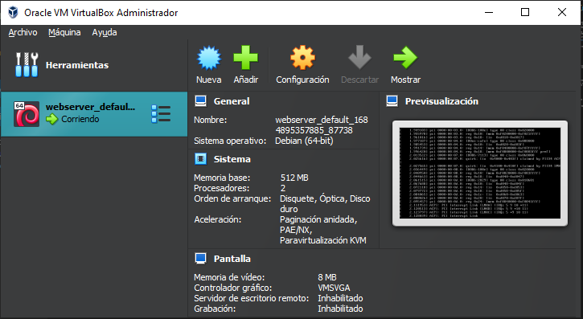
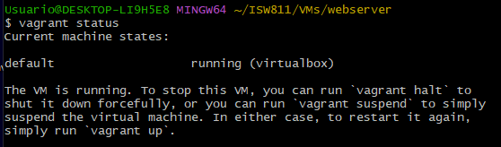

# Workshop01 - Vagrant


## Instalación VirtualBox
Para instalación de virtualbox, entre al enlace y busque la versión disponible para su correspondiente sistema operativo y arquitectura.

[Virtual Box](https://www.virtualbox.org/wiki/Downloads "Descargar Virtual Box")

## Instalación Vagrant
Para instalación de vagrant, entre al enlace y de igual manera seleccione la version para su sistema operativo y arquitectura del mismo.

[Vagrant](https://www.virtualbox.org/wiki/Downloads "Descargar Vagrant")

## Aprovisionamiento de Maquina Bullseye

### **Primer Paso**

Se define la estructura de los directorios para realizar la instlación.

```bash
mkdir ISW811
cd ISW811
mkdir VMs
cd VMs
mkdir webserver
cd webserver
```
### **Segundo Paso**

Una vez ya estamos en el directorio **webserver**, vamos a inicializar el archivo **Vagrantfile** con el siguiente comando

```bash
vagrant init debian/bullseye64
```


en este archivo debemos editar la linea 35 para poder habilitar una red privada entre la máquina anfitriona y la máquina virtual.

### **Tercer Paso**

Con el comando 

```bash
vagrant up
``` 
se termina el aprovisionamiento de la máquina **(puede tomar unos segundos o minutos)**.

### **Cuarto Paso**

Verificamos en virtualbox que la maquina esta corriendo.



O con el comando

```bash
vagrant status
``` 

